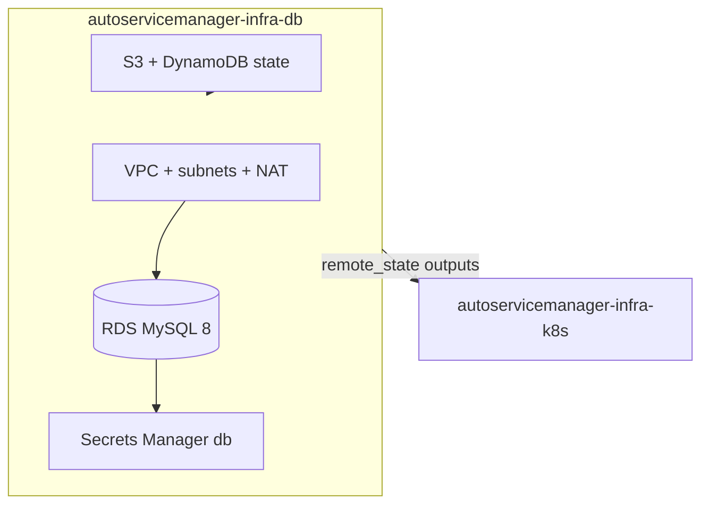

# autoservicemanager-infra-db

Terraform do stack **dados** (Fase 3): VPC compartilhada, RDS MySQL 8, Secrets Manager e state remoto S3+DynamoDB (ADR-008).

Repositório standalone (pós-cisão). Docs canônicos de arquitetura ficam no [autoservicemanager-app](https://github.com/dinhogt/autoservicemanager-app).

**Docs:** [RFC-002](https://github.com/dinhogt/autoservicemanager-app/blob/develop/docs/architecture/rfc-002-mysql-rds.md) · [ADR-008](https://github.com/dinhogt/autoservicemanager-app/blob/develop/docs/architecture/adr-008-terraform-remote-state.md) · [ER](https://github.com/dinhogt/autoservicemanager-app/blob/develop/docs/architecture/er-diagram.md) · [runbook](https://github.com/dinhogt/autoservicemanager-app/blob/develop/docs/runbook.md)

## Escopo neste repo



| Recurso | Detalhe |
|---------|---------|
| VPC | Subnets públicas/privadas + NAT único (custo acadêmico) |
| RDS MySQL 8 | `db.t3.micro`, privado, storage criptografado |
| SG RDS | **Sem ingress por default**; EKS/Lambda só via regras SG→SG no `infra-k8s` |
| Secrets Manager | `${project}-${env}/db` — JSON compatível com Lambda `DB_SECRET_ARN` |
| State | `db/homolog/terraform.tfstate` \| `db/prod/terraform.tfstate` |

**Por que VPC aqui?** Ordem de apply ADR-008: `infra-db` → `infra-k8s`. O stack k8s consome `vpc_*` + `db_*` via `terraform_remote_state`.

## Contrato de outputs (ADR-008)

| Output | Consumidor |
|--------|------------|
| `db_endpoint` / `db_port` / `db_sg_id` / `db_secret_arn` | Lambda, app, Security Groups |
| `vpc_id`, `private_subnet_ids`, `public_subnet_ids`, `vpc_cidr` | [infra-k8s](https://github.com/dinhogt/autoservicemanager-infra-k8s) |

## Pré-requisitos

- Terraform >= 1.5, AWS CLI
- Bootstrap state (uma vez): `./scripts/bootstrap-state.sh`

## Apply local

```bash
cp backend.hcl.example backend.hcl
cp terraform.tfvars.example terraform.tfvars
terraform init -backend-config=backend.hcl
TF_VAR_environment=homolog terraform plan
TF_VAR_environment=homolog terraform apply
```

Só validação: `terraform init -backend=false && terraform validate`.

## CI/CD (OIDC)

Workflows: [`.github/workflows/ci-cd.yml`](.github/workflows/ci-cd.yml) + [`security-gate.yml`](.github/workflows/security-gate.yml).

| Evento | Ação |
|--------|------|
| PR | `security-gate` → `fmt` + `validate` — **sem AWS** |
| Push `develop` | OIDC → plan/apply; key `db/homolog/` |
| Push `master` | OIDC → plan/apply; key `db/prod/` |

Secrets: `AWS_ROLE_ARN`. Var opcional: `TF_STATE_BUCKET`. Sem path filters de monorepo.

## Destroy

Ordem global: destruir **[infra-k8s](https://github.com/dinhogt/autoservicemanager-infra-k8s) primeiro**, depois este stack.
